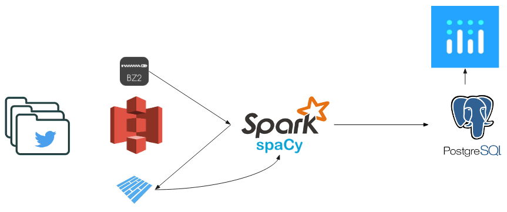

# InsightTweetDeals

## Description:
63% of customers expect companies to offer customer service via their social media channels. (Source: Smart Insights) To stay relevant, many retailers communicate new deals and offerings to their customers via social media (e.g.: Youtube, Instagram, Twitter…). 
It presents a unique opportunity to analyze different products offered online in a centralized fashion. 
At Insight, I am building a framework to compare the prices of different products over time from historic Twitter data. 
<b>This tool will enable businesses to compare their offerings against their competitors over time and more precisely target their advertising campaign by seeing what has and hasn’t worked in the past.</b>

## Content of the Repo:
- Conda_Environments: Contains the scripts to distribute and setup the Python environment on all instances
- Ingestion: Contains the scripts used to extract and laod Twitter data onto S3
- Processing: Contains the scripts and libraries built to transform S3 data into actionable information. All Spark relevant code is located here
- Schema: Contains a schema of the Twitter json file
- TestTwitterAPI: Some tests on the official Twitter APIs
- Visualization: Everything needed to run dash for the visualization. 

## Dataset
6 months of Twitter data dumps obtained from:https://archive.org/details/twitterstream?and[]=year%3A%222018%22

## Architecture:

## Possible Extensions:

This work could be extended first to use real streaming data using Twitter streaming API. 
Streaming could then be used to update the database, and make sure deals stay current and relevant. 
Much of it could be done with the infrastructure and adding Apache Airflow as well as a streaming service (Kafka) to 
schedule database clean up and schedule API calls and batch jobs to update the content of the database. 

## What is Insight Data Science?
The Insight Data Science Fellows Program is an intensive seven week post-doctoral training fellowship bridging the gap to new careers in data related fields.
http://insightdatascience.com/

